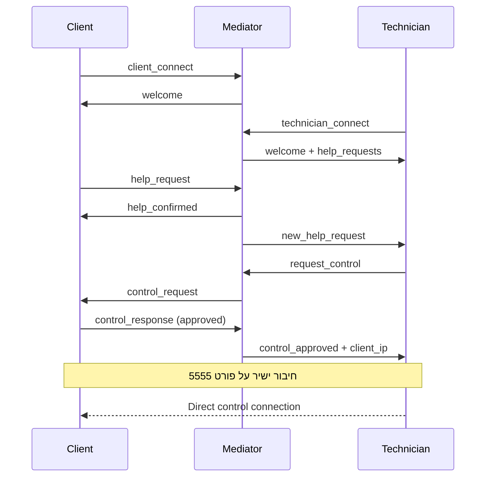

# מערכת בקרה מרחוק עם שרת מתווך - תיעוד מלא

## סקירה כללית

המערכת כוללת שלושה רכיבים עיקריים שמאפשרים לטכנאים לעזור ללקוחות באמצעות בקרה מרחוק מנוהלת:

1. **שרת מתווך** (`mediator_server.py`) - מנהל את התקשורת בין לקוחות וטכנאים
2. **לקוח** (`client_with_mediator.py`) - מחשב שמבקש עזרה
3. **טכנאי** (`technician_with_mediator.py`) - טכנאי שמספק עזרה

## ארכיטקטורת המערכת

```
     ┌─────────────────┐
     │   Mediator      │
     │   Server        │
     │   Port: 5556    │
     └─────────┬───────┘
               │
         ┌─────┴─────┐
         │           │
    ┌────▼──┐   ┌────▼──┐
    │Client │   │Tech   │
    │Port:  │   │       │
    │5555   │◄──┤       │
    └───────┘   └───────┘
    
    שלב 1: חיבור לשרת המתווך
    שלב 2: בקשת עזרה ואישור
    שלב 3: חיבור ישיר לבקרה
```

## פרוטוקולי תקשורת

### יציאות

- **שרת מתווך**: 5556
- **לקוח (שרת בקרה ישיר)**: 5555

### פורמט הודעות

כל ההודעות נשלחות בפורמט JSON על גבי TCP sockets.

## הודעות JSON - פרוטוקול מלא

### 1. חיבור לקוח לשרת המתווך

**שליחה מהלקוח:**
```json
{
    "type": "client_connect",
    "name": "Client-10.0.0.28",
    "ip": "10.0.0.28"
}
```

**תגובה מהשרת:**
```json
{
    "type": "welcome",
    "client_id": "a1b2c3d4",
    "status": "connected"
}
```

### 2. חיבור טכנאי לשרת המתווך

**שליחה מהטכנאי:**
```json
{
    "type": "technician_connect",
    "name": "Tech-10.0.0.15",
    "ip": "10.0.0.15"
}
```

**תגובה מהשרת:**
```json
{
    "type": "welcome",
    "technician_id": "e5f6g7h8",
    "status": "connected",
    "help_requests": [
        {
            "client_id": "a1b2c3d4",
            "name": "Client-10.0.0.28",
            "ip": "10.0.0.28",
            "timestamp": "2025-01-20 14:30:25"
        }
    ]
}
```

### 3. בקשת עזרה מלקוח

**שליחה מהלקוח:**
```json
{
    "type": "help_request"
}
```

**תגובה לקוח:**
```json
{
    "type": "help_confirmed",
    "message": "Your help request has been sent to available technicians"
}
```

**הודעה לכל הטכנאים:**
```json
{
    "type": "new_help_request",
    "client_id": "a1b2c3d4",
    "name": "Client-10.0.0.28",
    "ip": "10.0.0.28",
    "timestamp": "2025-01-20 14:30:25"
}
```

### 4. בקשת שליטה מטכנאי

**שליחה מהטכנאי:**
```json
{
    "type": "request_control",
    "client_id": "a1b2c3d4"
}
```

**הודעה ללקוח:**
```json
{
    "type": "control_request",
    "technician_name": "Tech-10.0.0.15",
    "technician_ip": "10.0.0.15",
    "tech_id": "e5f6g7h8"
}
```

### 5. תגובת לקוח לבקשת שליטה

**אישור:**
```json
{
    "type": "control_response",
    "tech_id": "e5f6g7h8",
    "approved": true
}
```

**דחייה:**
```json
{
    "type": "control_response",
    "tech_id": "e5f6g7h8",
    "approved": false
}
```

### 6. תגובות השרת לטכנאי

**אישור שליטה:**
```json
{
    "type": "control_approved",
    "client_id": "a1b2c3d4",
    "client_ip": "10.0.0.28",
    "client_name": "Client-10.0.0.28",
    "session_id": "s1s2s3s4"
}
```

**דחיית שליטה:**
```json
{
    "type": "control_denied",
    "client_id": "a1b2c3d4",
    "client_name": "Client-10.0.0.28"
}
```

### 7. הודעות מערכת נוספות

**ביטול בקשת עזרה:**
```json
{
    "type": "cancel_help"
}
```

**לקוח מתנתק:**
```json
{
    "type": "client_disconnected",
    "client_id": "a1b2c3d4"
}
```

**לקוח לא זמין:**
```json
{
    "type": "client_unavailable",
    "client_id": "a1b2c3d4"
}
```

**סיום סשן:**
```json
{
    "type": "end_session",
    "session_id": "s1s2s3s4"
}
```

**הודעות Heartbeat:**
```json
{
    "type": "heartbeat"
}
```

```json
{
    "type": "heartbeat_response"
}
```

## תהליכי העבודה

### תהליך בקשת עזרה מלא



### מצבי המערכת

#### מצבי לקוח:
1. **מנותק** - לא מחובר לשרת המתווך
2. **מחובר** - מחובר לשרת אבל לא ביקש עזרה
3. **מבקש עזרה** - שלח בקשת עזרה וממתין לטכנאי
4. **בסשן** - טכנאי שולט במחשב

#### מצבי טכנאי:
1. **מנותק** - לא מחובר לשרת המתווך
2. **זמין** - מחובר ורואה בקשות עזרה
3. **מבקש שליטה** - שלח בקשת שליטה וממתין לאישור
4. **בשליטה** - שולט במחשב הלקוח

## הוראות הפעלה

### הפעלת המערכת

#### 1. הפעלת שרת המתווך
```bash
cd keyboard_control
python mediator_server.py
```
- לחץ על "Start Server"
- השרת יעלה על יציאה 5556

#### 2. הפעלת לקוח
```bash
cd keyboard_control
python client_with_mediator.py
```
- הזן את כתובת ה-IP של שרת המתווך
- הזן את שמך
- לחץ "Connect to Mediator"
- שרת הבקרה יעלה אוטומטית על יציאה 5555

#### 3. הפעלת טכנאי
```bash
cd keyboard_control
python technician_with_mediator.py
```
- הזן את כתובת ה-IP של שרת המתווך
- הזן את שמך
- לחץ "Connect to Mediator"

### תהליך מתן עזרה

#### צד הלקוח:
1. התחבר לשרת המתווך
2. לחץ "Request Help"
3. המתן לבקשת שליטה מטכנאי
4. אשר או דחה את הבקשה
5. אם אישרת - הטכנאי יקבל שליטה

#### צד הטכנאי:
1. התחבר לשרת המתווך
2. ראה רשימת בקשות עזרה
3. בחר לקוח ולחץ "Request Control"
4. המתן לאישור הלקוח
5. אם אושר - תקבל חיבור ישיר ושליטה

### בקרת מקלדת ועכבר

#### עכבר:
- תנועה: העבר עכבר על המסך המרוחק
- לחיצה שמאלית: לחץ שמאל על המסך
- לחיצה ימנית: לחץ ימין על המסך

#### מקלדת:
- **מצב אוטומטי**: המקלדת פעילה אוטומטי כשיש חיבור
- **מקשי מהירות**: Alt+Tab, Ctrl+Alt+Del, Win+D, וכו'
- **שליחת טקסט**: שדה "Send Text" לטקסט ארוך

## ניהול שגיאות ואבטחה

### טיפול בשגיאות

#### בעיות חיבור:
- **"Connection timeout"**: בדוק שהשרת פועל וכתובת ה-IP נכונה
- **"Connection refused"**: ודא שהיציאות פתוחות (5555, 5556)
- **"Frequent disconnections"**: בדוק יציבות הרשת

#### בעיות ביצועים:
- **איכות תמונה**: מותאמת אוטומטית ל-60% JPEG
- **זמן תגובה**: תלוי באיכות הרשת
- **שימוש ב-CPU**: נורמלי עקב צילומי מסך רציפים

### אבטחה

#### מגבלות הנוכחיות:
- **ללא הצפנה**: התקשורת לא מוצפנת
- **אמון מלא**: הלקוח צריך לסמוך על הטכנאי
- **רשת מקומית**: מיועד לרשתות מהימנות

#### הגנות קיימות:
- **אישור מפורש**: הלקוח חייב לאשר כל בקשת שליטה
- **ניתוק מיידי**: הלקוח יכול לנתק בכל עת
- **חיבור יחיד**: רק טכנאי אחד יכול לשלוט בו-זמנית

## קבצי המערכת

### קבצי הליבה:
- `mediator_server.py` - שרת המתווך הראשי
- `client_with_mediator.py` - לקוח עם תמיכה במתווך
- `technician_with_mediator.py` - טכנאי עם תמיכה במתווך

### קבצי מערכת ישנים (לתאימות לאחור):
- `client.py` - לקוח מקורי (חיבור ישיר)
- `server.py` - טכנאי מקורי (חיבור ישיר)

### קבצי תיעוד:
- `MEDIATOR_SYSTEM_DOCUMENTATION.md` - מסמך זה
- `README_FIXED.md` - תיעוד הגרסה המקורית המתוקנת

### קבצי לוג:
- `mediator_log.txt` - לוג שרת המתווך
- `client_log.txt` - לוג הלקוח
- `technician_log.txt` - לוג הטכנאי

## הרחבות עתידיות

### תכונות מתוכננות:
1. **הצפנת תקשורת** - SSL/TLS לבטיחות
2. **אימות משתמשים** - סיסמאות ותעודות זהות
3. **העברת קבצים** - יכולת להעביר קבצים
4. **צ'אט טקסט** - תקשורת טקסטואלית
5. **הקלטת סשנים** - תיעוד פעילויות לביקורת

### שיפורים טכניים:
1. **דחיסת תמונה מתקדמת** - איכות טובה יותר עם נתונים פחותים
2. **ריבוי מסכים** - תמיכה במסכים מרובים
3. **בקרת רזולוציה** - התאמה דינמית של איכות
4. **מצב נצפייה בלבד** - צפייה ללא שליטה

## פתרון בעיות נפוצות

### בעיית חיבור למתווך:
```
בדוק:
1. שרת המתווך פועל?
2. כתובת IP נכונה?
3. יציאה 5556 פתוחה?
4. חומת אש לא חוסמת?
```

### בעיית שליטה:
```
בדוק:
1. לקוח אישר את הבקשה?
2. יציאה 5555 פתוחה אצל הלקוח?
3. חיבור רשת יציב?
```

### בעיית ביצועים:
```
פתרונות:
1. סגור יישומים מיותרים
2. בדוק מהירות רשת
3. הפחת איכות צילום מסך
4. שנה את תדירות הפינג
```

## מפרט טכני

### תלויות:
```
Python 3.7+
tkinter (GUI)
PIL (Pillow) - עיבוד תמונות
pyautogui - בקרת מקלדת ועכבר
socket, threading, json - תקשורת רשת
```

### הגדרות רשת:
```python
MEDIATOR_PORT = 5556        # יציאת שרת המתווך
REMOTE_CONTROL_PORT = 5555  # יציאת בקרה ישירה
BUFFER_SIZE = 8192          # גודל חוצץ רשת
SOCKET_TIMEOUT = 30         # זמן קצוב חיבור
HEARTBEAT_INTERVAL = 30     # תדירות בדיקת חיות
```

### פורמטי נתונים:
- **JSON**: הודעות בין המתווך והצדדים
- **Pickle**: פקודות בקרה בין טכנאי ולקוח
- **Base64**: העברת תמונות דחוסות
- **JPEG**: פורמט דחיסת צילומי מסך

---

**מחבר**: מערכת בקרה מרחוק עם מתווך  
**גרסה**: 1.0  
**תאריך**: 2025-01-20 